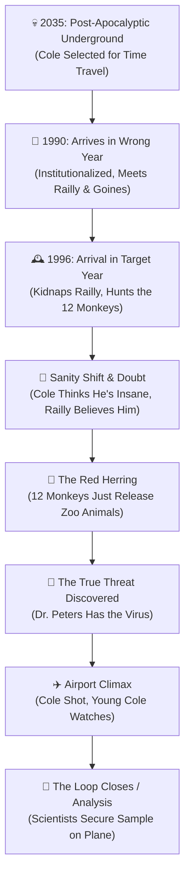

# 12 Monkeys (1995) - Podcast Research Cheat Sheet

> *"The future is history."*

---

## 🎬 Visual Story Progression: The Time Loop

### Narrative Flow Diagram

### Phase-by-Phase Breakdown

1. **Phase 1: 2035 Dystopia & The Mission**
   - James Cole is a "volunteer" prisoner in a grim, disease-free underground facility. He is sent to the surface to gather biological samples and is eventually selected for a time-travel mission to 1996 to locate the original virus source.
   
2. **Phase 2: 1990 Asylum - Wrong Year**
   - Due to a miscalculation, Cole arrives in 1990. He is institutionalized after ranting about a future plague. He meets psychiatrist Dr. Kathryn Railly and a manic, anti-consumerist patient named Jeffrey Goines. Cole escapes by suddenly "disappearing" back to the future.

3. **Phase 3: 1996 - The Target Year**
   - After a brief accidental stop in WWI trenches, Cole arrives in 1996. He kidnaps Dr. Railly and forces her to take him to Philadelphia to find the "Army of the 12 Monkeys," which he believes released the virus. They discover the group is led by Jeffrey Goines.

4. **Phase 4: Sanity Shift & Cassandra Complex**
   - The roles reverse. Cole, exhausted by the time jumps, convinces himself that he is completely insane and the 2035 future is a delusion. Conversely, Dr. Railly finds physical evidence (a WWI photo with Cole in it) and realizes his apocalyptic warnings are real.

5. **Phase 5: The Red Herring & The True Threat**
   - They discover the "Army of the 12 Monkeys" is just an animal rights group pulling a prank by releasing zoo animals into the city. The actual threat is Dr. Peters, a misanthropic assistant to Goines' virologist father, who intends to release a weaponized virus globally.

6. **Phase 6: The Climax & Ending Analysis**
   - At the airport, Cole tries to shoot Dr. Peters before he boards his flight but is gunned down by police. Dr. Railly holds the dying Cole, making eye contact with a young boy—Cole himself as a child, witnessing his own death, cementing the trauma that haunts his dreams.
   - **Ending Analysis:** Dr. Peters boards the plane and sits next to Jones, a prominent scientist from 2035, who introduces herself by saying, "I'm in insurance." This brilliant ending confirms the closed time loop: the future cannot be changed. The scientists didn't send Cole to save the past; they sent him to identify the virus so they could secure an unmutated sample on that very flight to synthesize a cure for the future survivors.

---

## ⚠️ Deep-Dive: Plot Holes, Theme Inconsistencies & Hidden Messaging

### 1. The Predestination Paradox (Thematic Feature, not a Bug)
- **The Issue:** A common criticism is asking why the scientists don't just kill Peters and stop the plague.
- **Podcast Angle:** It's a rigid closed-loop timeline. Everything Cole does to try and stop the plague actually sets the events in motion. It's a tragedy of inevitability.

### 2. The Voice in Cole's Head
- **The Issue:** Cole hears a raspy voice ("Bob") calling him throughout the movie. In 1996, a homeless man seems to be the source. Is it a symptom of his mental breakdown, or another time traveler whose mind broke from the jumps?
- **Podcast Angle:** The film heavily leans into ambiguity. It forces the audience to constantly question if the sci-fi elements are real or the tragic delusions of a deeply traumatized mind.

### 3. Hidden Messaging: Animal Liberation vs Human Extinction
- **The Issue:** The Army of the 12 Monkeys is a misdirection, but their cause mirrors the virus's effect.
- **Podcast Angle:** The film portrays humanity as the true "virus" destroying the planet. When the human plague hits, the animals reclaim the Earth—perfectly symbolized by the majestic lions roaming the snow-covered streets of Philadelphia.

### 4. Hidden Messaging: The Cassandra Complex
- **The Issue:** Dr. Railly explicitly lectures on the "Cassandra Complex"—knowing the future but being doomed to not be believed.
- **Podcast Angle:** The film is a masterclass in how society institutionalizes truth-tellers. Madness is depicted not as a sickness, but as the only sane reaction to a world heading toward self-destruction.

---

## ⚡ Ground Facts
- **Release Date:** December 29, 1995 (Limited) / January 5, 1996 (Wide)
- **Budget:** ~$29.5M
- **Box Office:** $168.8M worldwide (Massive Hit)
- **Runtime:** 129 minutes
- **Director:** Terry Gilliam
- **Screenplay:** David Peoples, Janet Peoples (Inspired by Chris Marker's 1962 short film La Jetée)
- **Main Cast:** Bruce Willis (James Cole), Brad Pitt (Jeffrey Goines), Madeleine Stowe (Kathryn Railly), Christopher Plummer (Dr. Leland Goines), David Morse (Dr. Peters).

---

## ⚡ History & Production
- **Inspired by La Jetée:** It's a feature-length adaptation of Chris Marker's legendary 1962 French short film La Jetée, which was composed almost entirely of still photographs and explored the same themes of memory, time loops, and witnessing one's own death.
- **Brad Pitt's Method Madness:** Brad Pitt voluntarily spent weeks in the psychiatric ward of Temple University Hospital to prepare for his role as the unhinged Jeffrey Goines. His manic, twitchy performance won him a Golden Globe and his first Oscar nomination.
- **Bruce Willis's Paycut & Restrictions:** Bruce Willis took a significant pay cut to work with Terry Gilliam. Gilliam literally handed Willis a list of "Bruce Willis Acting Clichés" (like his trademark smirking) that he was strictly banned from using on set.
- **The Steampunk Future:** The production design deliberately avoided sleek, high-tech sci-fi aesthetics. The 2035 future is a claustrophobic, rusty, "cobbled together" nightmare to reflect humanity's regression into the sewers.

---

## 📈 Market & Critical Reception
- **Box Office Success:** Released in late 1995, it became a massive critical and commercial success, grossing $168.8 million against a modest $29.5 million budget.
- **Critical Acclaim:** Critics praised its complex, labyrinthine narrative, its oppressive and brilliant atmosphere, and the career-defining performances from both Willis and Pitt. It is widely considered one of the greatest time-travel movies ever made.

---

## 🎙️ Host Talking Points & Banter Prompts
- **The "It Was All a Dream" Theory:** Debate whether Cole was just a schizophrenic patient the entire time, and the "future" and "virus" were all elaborate delusions woven from elements around him in 1990 (like the monkeys on TV, or the scientist in his asylum).
- **The Insurance Line:** When the future scientist says "I'm in insurance," does she mean she's going to kill Peters and prevent the outbreak (breaking the film's own time travel rules), or just ensure they get the virus sample?
- **Brad Pitt's Hand Gestures:** Challenge your co-host to replicate Jeffrey Goines' manic, erratic hand movements while discussing the plot.

---

## 🔄 Podcast Call-Backs & Cinematic Connections
- **Demolition Man (1993) Connection:** Both feature a tough-guy action star (Willis/Stallone) displaced from their normal timeline into a bizarre, restrictive future/alternate timeline, struggling to adapt.
- **The Terminator (1984) Connection:** Both deal with closed time loops where the attempt to alter the timeline ends up directly causing the events they were trying to prevent.
