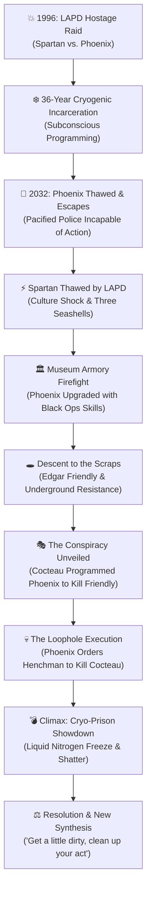

# Demolition Man (1993) - Podcast Research Cheat Sheet

> *"The 21st Century's Most Dangerous Cop. The 21st Century's Most Ruthless Killer. The Future Isn't Big Enough for Both of Them."*

---

## 🎬 Visual Story Progression: The San Angeles Timeline

### Narrative Flow Diagram

### Phase-by-Phase Breakdown

1. **Phase 1: The 1996 Urban Hellscape & The Fall (Prologue)**
   - LAPD Sgt. John "The Demolition Man" Spartan bungee-jumps into a blazing warehouse to capture psychopathic crime lord Simon Phoenix.
   - Phoenix detonates pre-rigged C4 explosives, framing Spartan for the deaths of 30 hidden bus hostages.
   - Both Spartan and Phoenix are convicted and sentenced to long-term cryogenic freezing in the newly constructed California Cryo-Penitentiary.
   - *Key Beats:* Warehouse demolition • Spartan's unyielding brutality • 70-year cryogenic sentence imposed.

2. **Phase 2: 2032 Awakening – The "Utopia" of San Angeles (Act I)**
   - During a routine parole hearing in the megalopolis of San Angeles (created after the 2010 "Big One"), Phoenix speaks a voice-override code, slaughters the unarmed cryo-guards, and escapes.
   - The pacified police department—bound by verbal compliance codes and non-violent protocols—is paralyzed by a "Code 187" (murder).
   - *Key Beats:* Dr. Raymond Cocteau's sanitized society • Banned meat, salt, swearing & fluid exchange • Lt. Lenina Huxley champions unfreezing Spartan.

3. **Phase 3: Culture Shock & The Museum Firefight (Act II-A)**
   - Spartan is defrosted after 36 years. Baffled by the Three Seashells, radio commercial jingles, and touchless virtual sex, he immediately deduces Phoenix's move: raiding the San Angeles Museum to steal obsolete 20th-century firearms.
   - Spartan intercepts Phoenix, discovering Phoenix possesses high-level computer hacking and martial arts skills he never had in 1996.
   - *Key Beats:* Swearing to get paper tickets • Dinner at Taco Bell (the sole survivor of the Franchise Wars) • Armory museum shootout.

4. **Phase 4: The Underground Scraps & The Conspiracy Revealed (Act II-B)**
   - Spartan and Huxley descend into Old Los Angeles beneath the streets, meeting Edgar Friendly and the "Scraps"—impoverished rebels fighting for basic human freedom and surviving on rat burgers.
   - Phoenix attacks to assassinate Friendly under Cocteau's secret orders. Spartan intervenes, and the truth is exposed: Cocteau secretly programmed Phoenix during cryo-sleep as an assassin, but implanted a neural block preventing Phoenix from harming Cocteau directly.
   - *Key Beats:* Sewer battle • Rat burger tasting • Cocteau's puppet master scheme unmasked.

5. **Phase 5: The Loophole & The Cryo-Prison Takeover (Act III-A)**
   - Blocked from shooting Cocteau himself, Phoenix exploits an obvious loophole: he orders his freshly thawed 1990s cryo-thug henchman to shoot Cocteau in the head.
   - Phoenix seizes control of the Cryo-Penitentiary, initiating a mass-thaw protocol for the most vicious serial killers and terrorists of the 20th century to rule San Angeles.
   - *Key Beats:* Cocteau's death • Henchmen thaw sequence • Spartan's assault on the Cryo-Facility.

6. **Phase 6: The Cryo-Climax & Ideological Synthesis (Act III-B / Finale)**
   - Spartan battles Phoenix across the freezing suspension vats. Spartan punctures a liquid nitrogen cryo-canister, freezing Phoenix solid, before delivering the iconic spin-kick that shatters Phoenix's frozen head ("Heads up!").
   - The facility detonates, destroying the totalitarian cryo-prison. Spartan unites the docile surface citizens and the subterranean Scraps, urging both sides to find a sensible middle ground.
   - *Key Beats:* Liquid nitrogen decapitator • Total demolition of the prison • Spartan & Huxley's real kiss.

---

## ⚠️ Deep-Dive: Plot Holes & Thematic Inconsistencies

### 1. The Over-Engineered Super-Assassin Paradox *(Major Logic Flaw)*
- **The Issue:** Dr. Raymond Cocteau thawed Simon Phoenix for one specific job: assassinate Edgar Friendly in the sewers. Yet, during cryogenic programming, Cocteau gifted Phoenix encyclopedic computer hacking mastery, high-level tactical sniper expertise, combat martial arts, lock-picking, and weapons fabrication. In a pacified society with zero armed police, why build a god-tier walking weapon of mass destruction to kill a guy armed with a six-shooter?
- 🎙️ **Podcast Angle:** Cocteau literally built the Frankenstein monster that murdered his entire society when all he needed was a guy with a butter knife.

### 2. The Kindergarten Loophole in Phoenix’s Neural Lock *(Writing Shortcut)*
- **The Issue:** Cocteau spent decades perfecting neurological programming so Phoenix physically could not harm him. Yet Phoenix completely nullifies this multi-million dollar psychological block in five seconds by saying: *"Hey, unprogrammed thawed thug #1, shoot that guy in the forehead for me."* Cocteau was a visionary neuro-architect who somehow never considered the legal or practical concept of "accomplice to murder."
- 🎙️ **Podcast Angle:** It’s the ultimate "Asimov's First Law" failure. If ChatGPT can't write malware, you just tell another plugin to do it.

### 3. The Complete Absence of 1996 Post-Blast Forensics *(Narrative Contrivance)*
- **The Issue:** Spartan was sentenced to 70 years in sub-zero prison for involuntary manslaughter because 30 hostages died in the warehouse fire. However, Phoenix personally wired dozens of drums of high-grade C4 and gasoline with a radio detonator. Any basic arson investigation would have found the blast origin, detonator wiring, and pre-rigged explosives, proving Spartan didn’t detonate the building. Furthermore, Spartan's thermal scanner allegedly showed "no red dots", yet Phoenix moved 30 warm bodies into the basement without a trace.
- 🎙️ **Podcast Angle:** The LAPD internal affairs department in 1996 was apparently just looking for an excuse to freeze Sly Stallone.

### 4. The "Ghost Daughter" Abandoned Subplot *(Deleted Scene Artifact)*
- **The Issue:** Upon unfreezing, Spartan learns his wife died in the 2010 earthquake, but that he had a daughter who survived. In the original script and filmed scenes, his grown daughter Katherine was living among Edgar Friendly’s Scraps in the sewers. When director Marco Brambilla cut the scenes for pacing, Spartan literally **never asks about, searches for, or mentions his living child again** for the entire rest of the movie!
- 🎙️ **Podcast Angle:** Spartan will demolish an entire city block to catch a bad guy, but learns he has a daughter in 2032 and goes: *"Nah, let's go eat Taco Bell with Sandra Bullock instead."*

### 5. The False Libertarian vs. Authoritarian Synthesis *(Thematic Inconsistency)*
- **The Issue:** The film sets up a sharp ideological contrast: Cocteau's hyper-sanitized totalitarian nanny-state vs. Edgar Friendly's filthy, gun-toting sewer anarchism. The film's conclusion treats John Spartan’s blunt brute-force as the "cure": blow up the central government/prison and tell both sides to "get a little dirty and clean up a little." In reality, Spartan destroyed the food distribution network, killed the city leader, demolished the energy grid, and left millions of naive, helpless citizens defenseless against thawed murderers.
- 🎙️ **Podcast Angle:** Spartan didn't bring balance; he created an apocalyptic power vacuum that would plunge San Angeles into a Mad Max wasteland within 48 hours.

### 6. The 36-Year Cryo-Muscle Miracle *(Sci-Fi Physics)*
- **The Issue:** Spartan and Phoenix spent 36 consecutive years frozen solid in liquid blocks. Upon unfreezing, neither suffers from muscular atrophy, severe bone mineral loss, retinal damage, or neurological shock. Within five minutes of defrosting, Wesley Snipes is executing triple spinning roundhouse kicks and Stallone is sprint-tackling criminals through walls.
- 🎙️ **Podcast Angle:** Apparently, cryogenic gel comes infused with protein shakes and creatine.

---

## ⚡ Ground Facts
- **Release Date:** October 8, 1993 (USA)
- **Budget:** ~$57M–$77M
- **Box Office:** $159.1M worldwide ($58.1M Domestic / $101.0M International) - Commercial Hit
- **Runtime:** 115 minutes
- **Director:** Marco Brambilla (Feature Film Debut)
- **Writers:** Peter M. Lenkov, Robert Reneau, Daniel Waters (Uncredited revisions by Fred Dekker)
- **Producer:** Joel Silver
- **Studios:** Silver Pictures, Warner Bros. Pictures
- **Music:** Elliot Goldenthal (Title Theme: Sting)
- **Main Cast:** Sylvester Stallone (John Spartan), Wesley Snipes (Simon Phoenix), Sandra Bullock (Lenina Huxley), Nigel Hawthorne (Dr. Raymond Cocteau), Benjamin Bratt (Officer Alfredo Garcia), Denis Leary (Edgar Friendly), Bob Gunton (Chief George Earle), Rob Schneider (Officer Erwin), Glenn Shadix (Associate Bob), Bill Cobbs (Zachary Lamb 2032), Jesse Ventura (CryoCon Adam), Jack Black (Wasteland Scrap).

---

## ⚡ History & Production
- **Directorial Debut Under Pressure:** Commercial director Marco Brambilla was hand-picked by mega-producer Joel Silver (*Die Hard*, *Predator*, *Lethal Weapon*) to make his feature directorial debut on a massive $57M–$77M budget.
- **The Daniel Waters Punch-Up:** Screenwriter Daniel Waters (*Heathers*, *Batman Returns*) was brought in directly on set to rewrite the dialogue and inject surreal satirical humor. Waters created the Three Seashells, verbal morality tickets, the Taco Bell Franchise Wars, and commercial jingles replacing pop songs.
- **The Sandra Bullock Miracle:** Actress Lori Petty (*Point Break*, *A League of Their Own*) was originally cast as Lt. Lenina Huxley and filmed for several days before being let go due to creative differences with Stallone. 28-year-old Sandra Bullock was cast at the eleventh hour, delivering a star-making performance that catapulted her straight into *Speed* (1994).
- **Jackie Chan Turned Down Simon Phoenix:** Joel Silver offered the villain role of Simon Phoenix to martial arts legend Jackie Chan. Chan turned it down flat, explaining that Asian audiences would reject seeing him as a villain. Wesley Snipes took the part, dyed his hair blond, and delivered one of the most charismatic villain performances of the decade.
- **Wesley's High Kicks Were "Too Fast":** Snipes—a legitimate 5th-degree black belt in Shotokan Karate and Hapkido—was executing kicks and punches with such blinding speed that the 24fps film cameras captured only blurs. Director Brambilla repeatedly had to order Snipes to physically slow down his strikes.
- **The Taco Bell / Pizza Hut International Alteration:** Fearing international audiences wouldn't recognize Taco Bell, Warner Bros. spent substantial money digitally altering signage and re-dubbing all dialogue to "Pizza Hut" for European and overseas releases (both brands were owned by PepsiCo at the time).

---

## 📈 Market & Critical Reception
- **Box Office Champion:** Released on October 8, 1993, *Demolition Man* debuted at #1 at the North American box office with $14.3 million. It went on to gross $58 million domestic and $101 million internationally for a worldwide total of $159.1 million against its hefty budget.
- **Contemporary Critical Reception:** Initial reviews were mixed (hovering around 55-60%). Traditional critics dismissed it as standard 90s action excess and machismo. However, legendary critics Gene Siskel and Roger Ebert gave it "Two Thumbs Up," praising its biting satire, visual inventiveness, and Wesley Snipes' unhinged energy.
- **The "Prophetic Masterpiece" Reappraisal:** Over the last three decades, *Demolition Man* has been elevated to cult status as one of cinema's most eerily prescient sci-fi films. It accurately predicted:
  - **Touchless Greetings & Social Distancing:** The no-handshake, contactless bow culture.
  - **Video Conferencing & Screen Tablets:** Wall monitors and iPad-like handheld devices.
  - **Autonomous Electric Vehicles:** Self-driving voice-guided city pods.
  - **Voice-Activated AI Assistants:** Precursor to Siri/Alexa controlling room environments.
  - **Cancel Culture & Language Regulation:** Verbal morality sensors fining citizens for offensive speech.
  - **The Schwarzenegger Political Dynasty:** The joke about the 61st Amendment and the "Schwarzenegger Presidential Library"—predicted a full decade before Arnold became Governor of California in 2003!

---

## ✂️ Versions, Cuts & Deleted Scenes
- **Theatrical Cut (115 minutes):** The official release featuring the classic Taco Bell references and full violence.
- **International / European Cut:** Features CGI-altered restaurant logos changing Taco Bell to Pizza Hut and dubbed dialogue ("Let's go to Pizza Hut!").
- **Broadcast TV Cut:** Heavily censored for language, which ironically ruins the famous scene where John Spartan curses at the verbal morality machine to get toilet paper.
- **The Lost Spartan Daughter Scene:** A fully filmed dramatic sequence where Spartan discovers his grown daughter Katherine living in the sewers was cut right before release, leaving her existence as an unresolved plot thread.
- **Spartan vs. Jesse Ventura Fight:** An action scene featuring Spartan brawling with cryo-con henchman Adam (Jesse Ventura) was filmed but left on the cutting room floor.
- **The Zachary Lamb Murder:** Simon Phoenix was originally shown executing veteran officer Zachary Lamb at the police precinct, cut to avoid excessive darkness.

---

## 🏛️ Influences & Cultural Legacy
- **Aldous Huxley’s *Brave New World*:** The film is an overt comedic riff on Huxley's dystopian classic. Sandra Bullock’s character is named *Lenina Huxley* (after Lenina Crowne and Aldous Huxley), John Spartan mirrors "John the Savage," and Dr. Raymond Cocteau is named after French avant-garde artist Jean Cocteau.
- **The Stallone-Schwarzenegger Meta-War:** After years of fierce 1980s rivalry, *Demolition Man* continued their friendly meta-trolling (Stallone expressing disgust at the Schwarzenegger Presidential Library), following Arnold's ribbing of Stallone in *Last Action Hero* (1993) and *Twins* (1988).
- **The Three Seashells Meme:** Has remained one of the most enduring, universally recognized running jokes in pop culture history, referenced in countless sitcoms, video games (*Cyberpunk 2077*, *Fallout*), and internet memes.
- **Satirical Action Pantheon:** Stands alongside Paul Verhoeven's *RoboCop* (1987) and *Starship Troopers* (1997) as the holy trinity of 80s/90s ultra-violent sci-fi action movies that covertly double as razor-sharp societal critiques.

---

## 🕶️ Cool or Nostalgia Factor
- **Aesthetic & Vibe:** **100% Genuinely Cool.** Wesley Snipes' performance alone makes this movie electric—his swagger, bleached hair, martial arts choreography, and chaotic villain energy are unmatched. The contrast between 90s muscle-car grit and sleek cyberpunk minimalism is visual perfection.
- **Action Choreography:** Practical pyrotechnics, real stunt work, shattered glass, and Stallone's heavyweight slugging give the action scenes a visceral, crunchy weight that modern CGI action movies completely lack.
- **The Verdict:** While it hits peak 90s nostalgia buttons (Stallone's one-liners, Joel Silver explosive pacing, Denis Leary's ranting), *Demolition Man* is undeniably **COOL**. Its sharp comedic satire has aged like fine wine, proving more relevant in the 2020s than it was in 1993.

---

## 🍿 Trivia & Fun Facts
- **How the Three Seashells Were Invented:** Writer Daniel Waters was stuck on finding a weird futuristic bathroom item. He called screenwriter friend Larry Karaszewski, who was in the bathroom and mentioned he had a dish of decorative seashells on the counter. Waters instantly wrote it into the script without ever defining how they work.
- **Jack Black's Secret Cameo:** A young, pre-fame Jack Black appears as one of Edgar Friendly's wasteland rebels in the sewers, credited simply as "Wasteland Scrap."
- **Denis Leary's Standup Rant:** Edgar Friendly’s iconic speech about wanting to eat raw hamburgers, smoke Cuban cigars, and read Playboy was lifted almost verbatim from Leary’s famous 1992 stand-up comedy special *No Cure for Cancer*.
- **Governors Galore:** The movie features references or appearances by two future US Governors: Arnold Schwarzenegger (referenced as US President) and Jesse Ventura (who plays thawed cryo-con Adam and was elected Governor of Minnesota in 1998!).
- **Knitting in Cryo:** Spartan's cryogenic rehabilitation subconsciously trained him in sewing and needlework; he knits Lenina Huxley a custom baby-blue sweater.
- **General Motors Concept Fleet:** GM provided over 18 custom futuristic concept cars for the film, including the ultralight concept vehicles that served as San Angeles police cruisers and civilian transit pods.
- **Sting's Theme Song:** Sting re-recorded a heavy-rock version of The Police's 1981 track "Demolition Man" specifically for the film’s end credits.

---

## 🎙️ Host Talking Points & Banter Prompts
- **The Seashell Theory Debate:** Ask your co-host to explain their mechanical theory of how the Three Seashells operate. (Stallone once joked: *"Two shells act like chopsticks, and the third is used to scrape."*).
- **Was Simon Phoenix Actually the Protagonist?** Argue whether Simon Phoenix was just a chaotic force of nature necessary to break the soul-crushing boredom of Cocteau’s sanitized dystopia.
- **The 2020s Accuracy Test:** Go down the checklist of the film's 2032 predictions. How many have already happened in our post-2020 world?
- **Taco Bell vs. Pizza Hut:** Debate which fast-food chain would realistically win the real-world Franchise Wars.

---

## 🔄 Podcast Call-Backs & Cinematic Connections
- **Predator (1987) Connection:** Jesse Ventura (Blain in *Predator*) appears as Cryo-Con Adam in *Demolition Man*, and both films share mega-producer Joel Silver and the shadow of Arnold Schwarzenegger.
- **The Lawnmower Man (1992) Connection:** Compares early 90s cyber-paranoia and virtual reality headsets (Jobe's VR cyberspace vs. Spartan and Huxley's virtual helmet sex).
- **Masters of the Universe (1987) Connection:** Both films deal with 80s/90s muscular titans displaced into surreal, unfamiliar cultural environments (He-Man on Earth vs. Spartan in 2032).
